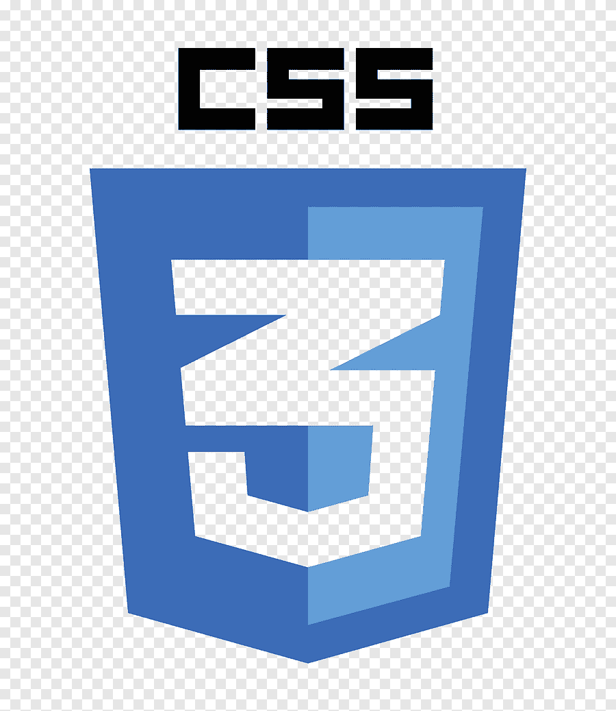
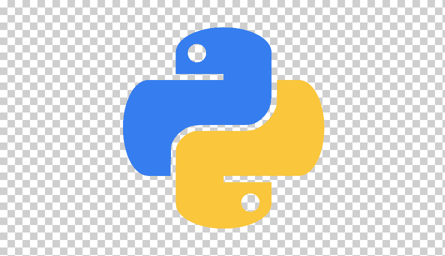
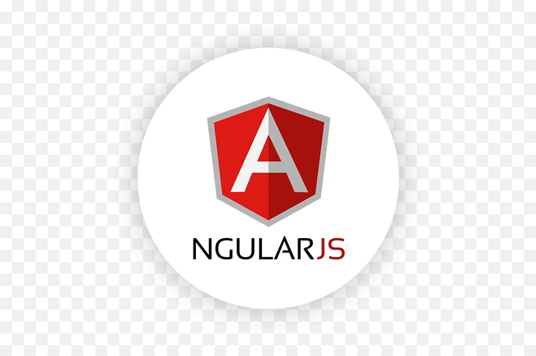

# Hello there, I’m @GabrielaGodek 🖐🏻

### Beginner front-end developer 

&nbsp; I study physics at the Cracow University of Technology, however, front-end issues have always interested me.
I am currently looking for an internship or a job as a junior front-end developer. I am characterized by an analytical approach to the problem, commitment, willingness to learn and openness to new experiences  
&nbsp; I speak English (Upper-Intermediate) and French (Beginner)

## Technologies 💻
-  &nbsp;&nbsp;&nbsp; HTML5  
- &nbsp;&nbsp;&nbsp; CSS3  
- &nbsp;&nbsp;&nbsp; JavaScript  
-  &nbsp;&nbsp;&nbsp; Visual Studio Code 
- &nbsp;&nbsp;&nbsp; Jira  
- &nbsp;&nbsp;&nbsp; Python  
-  C++  

## I’m currently learning 📝
-  &nbsp;&nbsp;&nbsp; React  
- &nbsp;&nbsp;&nbsp;  jQuery  
-  &nbsp;&nbsp;&nbsp; AJAX

## What I want to learn 📚
- &nbsp;&nbsp;&nbsp;  Node.js
- &nbsp;&nbsp;&nbsp; Vue.js
- &nbsp;&nbsp;&nbsp;  AngularJs
- &nbsp;&nbsp;&nbsp; Java

## Please do not hesitate to contact me
 &nbsp;&nbsp;&nbsp;&nbsp;&nbsp;&nbsp;
  
You can also visit my website (still working on it) ➡<a href="gabriela-godek.pl"> Gabriela Godek </a>

